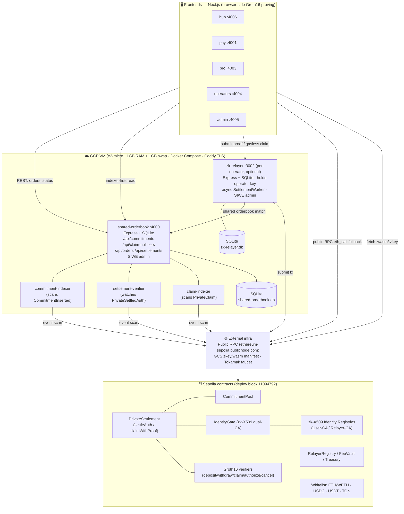

# System Architecture — scatter-dex on Sepolia (chainId 11155111)

How the live Sepolia deployment is wired: the browser frontends, the backend
services on a single VM, the on-chain contracts, and the external infrastructure.
The key design idea is that **privacy-critical work happens in the browser, and
reads go through indexers, not the chain directly**.

For setup steps (clone, tokens, zk-X509 verification, running an app), see the
[Sepolia team setup guide](./sepolia-team-setup.md).

## Diagram



<details>
<summary>ASCII fallback (if Mermaid doesn't render)</summary>

```
                ┌──────────────────────── BROWSER (clients) ────────────────────────┐
                │  hub:4006   pay:4001   pro:4003   operators:4004   admin:4005        │
                │  Next.js · local Groth16 proving (.wasm/.zkey)                      │
                └───┬───────────────┬──────────────────┬───────────────────┬─────────┘
        indexer-first│       submit/claim│         public RPC│            fetch zk assets│
        REST read    │       (proof)     │         fallback  │                          │
                     v                   v                   v                          v
        ┌────────────────────────── GCP VM (e2-micro, 1GB+swap) ─────────┐   ┌──────────────────┐
        │  shared-orderbook :4000 (Express+SQLite)                       │   │ EXTERNAL          │
        │   /api/commitments  /api/claim-nullifiers  /api/orders         │   │ • Public RPC      │
        │   /api/settlements  SIWE admin                                 │   │   (publicnode)    │
        │   ├─ commitment-indexer  (CommitmentInserted)                  │   │ • GCS zkey/wasm   │
        │   ├─ settlement-verifier (PrivateSettledAuth)                  │   │   manifest        │
        │   └─ claim-indexer       (PrivateClaim)                        │   │ • Tokamak faucet  │
        │  zk-relayer :3002 (per-operator, optional)                    │   └─────────┬─────────┘
        │   Express+SQLite · operator key · async SettlementWorker · SIWE│             │ event scan
        └───────────────────────────────┬───────────────────────────────┘             │ + submit tx
                              submit tx  │   (zk-relayer matches against orderbook, both │
                                         v    inside the VM)                            v
        ┌──────────────────────── SEPOLIA contracts (deploy block 11094792) ───────────────────┐
        │ CommitmentPool · PrivateSettlement(settleAuth/claimWithProof) · IdentityGate(zk-X509) │
        │ RelayerRegistry/FeeVault/Treasury · Groth16 verifiers · zk-X509 registries (User/Relayer-CA)│
        │ Token whitelist: ETH/WETH · USDC · USDT · TON                                          │
        └───────────────────────────────────────────────────────────────────────────────────────┘
```

</details>

## Component specs

### Frontend apps

| App | Port | Stack | Purpose |
|-----|------|-------|---------|
| hub | 4006 | Next.js | Navigation hub linking all apps |
| pay | 4001 | Next.js | Private bulk payouts (companies/DAOs) |
| pro | 4003 | Next.js | Private OTC trading (limit orders) |
| operators | 4004 | Next.js | Relayer-operator dashboard |
| admin | 4005 | Next.js | Protocol admin console |

- **Runtime**: all apps need Node.js 20+ (see the team setup [prerequisites](./sepolia-team-setup.md#one-time-prerequisites)).
- **Proving**: Groth16 in-browser via `.wasm` + `.zkey` fetched from the GCS manifest (sha256-verified).
- **Config**: `.env.local` generated from `contracts/deployments/11155111.json`; reads via public RPC by default.

### Backend services (one GCP VM)

| Service | Port | Stack | Storage | Notes |
|---------|------|-------|---------|-------|
| shared-orderbook | 4000 | Node 20-slim · Express 4 · ethers 6 · better-sqlite3 · express-rate-limit | SQLite `shared-orderbook.db` | Canonical order/settlement ledger + indexer hub; SIWE admin |
| commitment-indexer | — | same image (alt entrypoint) | shared DB | Scans `CommitmentInserted` → shared DB (served by shared-orderbook as `/api/commitments`) |
| settlement-verifier | — | same image | shared DB | Watches `PrivateSettledAuth`, flips `verified=1` |
| claim-indexer | — | same image | shared DB | Scans `PrivateClaim` → shared DB (served by shared-orderbook as `/api/claim-nullifiers`) |
| zk-relayer | 3002 | Node 20-slim · Express 4 · ethers 6 · better-sqlite3 | SQLite `zk-relayer.db` | Per-operator, optional (relayer compose profile); holds operator key; async `SettlementWorker` (202 Accepted → settle later); SIWE admin bound to operator wallet |

- **Live Sepolia box**: `http://136.115.115.93:4000` (shared-orderbook).
- **Indexer-first claim resolution**: SDK reads `/api/claim-nullifiers` first (authoritative, monotonic), with per-leaf RPC `eth_call` fallback.

### On-chain (Sepolia, chainId 11155111, deploy block 11094792)

| Contract | Address |
|----------|---------|
| CommitmentPool | `0x1c6bc81704f100C9EddeF79C151F7C2EbEa5848b` |
| PrivateSettlement | `0x9aA6CFc593aa76DD76015eB4752A05f3A78EA7a8` |
| IdentityGate (zk-X509 dual-CA) | `0x134ee727b5299e16Ee3fb3aEdf5Ba48D81B7AEa3` |
| RelayerRegistry | `0x38066496C050e8F45f5454a40d38797ED68dF826` |
| FeeVault | `0xC0E66b179753C26b9e2874639142F082c2d33A4e` |
| Treasury | `0x57a344C0BABA24B0716DEFb51F1a3f733795f3aa` |
| zk-X509 User-CA registry | `0x3cF6A96f1970053ffDf957074F988aD53D13ada3` |
| zk-X509 Relayer-CA registry | `0x9fDE6182B1fd10F2eDfE15b704FE95787C170914` |
| WETH | `0x7b79995e5f793A07Bc00c21412e50Ecae098E7f9` |

The committed ledger (`contracts/deployments/11155111.json`) is the single source
of truth — these addresses are reproduced here for reference only.

- **Proxy**: transparent (SharedAdminProxy); Groth16 verifiers are plain/non-upgradeable; identity registries are BeaconProxy.
- **Tokens**: ETH/WETH (18d), USDC (6d), USDT (6d), TON (18d).

### Infrastructure / hosting

| Item | Spec |
|------|------|
| Compute | GCP **e2-micro** VM · **1 GB RAM** + 1 GB swap file (OOM guard) · x86_64 |
| Orchestration | Docker Compose (services `restart: unless-stopped`); optional `relayer` profile + `compose.tls.yml` overlay |
| TLS | Caddy reverse proxy (activates when `DOMAIN` set) |
| Secrets | GCP Secret Manager (relayer key, RPC URL, admin token) — never in git/metadata |
| Images | GCP Artifact Registry; base `node:20-slim` |
| ZK assets | GCS bucket, sha256 manifest (`zk-manifest.json`) |
| RPC | Public node default (`https://ethereum-sepolia.publicnode.com`), overridable |
| Faucet | Tokamak testnet faucet (TON / USDC / USDT / ETH) |

> A single e2-micro hosts the orderbook + all three indexers; relayers are
> intended to run per-operator. The exact GCS bucket URL and the zk-X509 frontend
> service live outside this repo.

## Walkthrough

**Layer 1 — Frontends.** Five Next.js apps: a **hub** that links everything,
**pay** for private bulk payouts, **pro** for private OTC trading, **operators**
for relayer operators, and **admin** for protocol administration. Each app
generates its zero-knowledge proof **in the browser** — it downloads the proving
keys (`.wasm`/`.zkey`) from a GCS bucket and never sends a private input to a
server. Contract addresses come from a committed deployment file, and the chain
is read through a public RPC node by default.

**Layer 2 — Backend services.** Everything server-side runs on **one GCP e2-micro
VM** (1 GB RAM + 1 GB swap), orchestrated with Docker Compose. The main service is
the **shared-orderbook** on port 4000 — a Node/Express service backed by SQLite,
the canonical order and settlement ledger. Around it run **three indexer
sidecars** sharing the same database: one indexes commitment-tree leaves, one
verifies settlements on-chain, and one indexes spent claim nullifiers. These power
`/api/commitments` and `/api/claim-nullifiers`. Clients read these APIs first and
only fall back to RPC if an indexer is down. The **zk-relayer** on port 3002 is
optional and runs **per operator** — it holds the operator's signing key, accepts
a proof, immediately returns `202`, and settles on-chain asynchronously through a
durable worker queue. Both the orderbook and relayer protect admin endpoints with
**SIWE (Sign-In with Ethereum)**.

**Layer 3 — On-chain contracts.** The core is **CommitmentPool** (the Merkle tree
of private deposits) and **PrivateSettlement** (verifies the Groth16 proofs and
records claims). **IdentityGate** gates every settlement behind a zk-X509 identity
check against two CA registries (users and relayers). Supporting contracts:
RelayerRegistry, FeeVault, Treasury, and the standalone Groth16 verifiers. Four
tokens are whitelisted: ETH/WETH, USDC, USDT, TON.

**Layer 4 — External infrastructure.** A **public Sepolia RPC** for chain access,
a **GCS bucket** distributing the proving keys with sha256 verification, and the
**Tokamak faucet** for test tokens.

**A claim, end to end.** The user builds a proof in the browser; the SDK pulls the
commitment tree and claim status from the indexer; the proof goes to the relayer;
the relayer submits it to PrivateSettlement on Sepolia; the claim-indexer picks up
the on-chain event so the next status read is instant. Indexer-first, RPC as a
safety net, proving always client-side.
